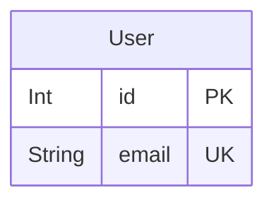

# Application ERD
> Generated by [`prisma-markdown`](https://github.com/samchon/prisma-markdown)

- [default](#default)

## default

### `User`
User model
This model is used to initialize the prisma client and can be changed according to the applications' needs.

**Properties**
  - `id`: The user's id (primary key). It is automatically generated.
  - `email`: The user's email. It is unique.